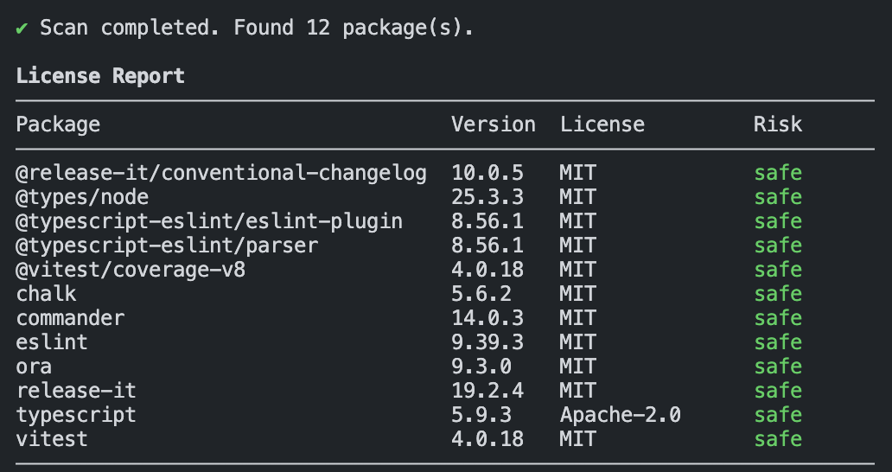

# licop - License Checker for npm Projects

> A modern CLI for auditing dependency licenses and enforcing license risk in CI.

[](https://www.npmjs.com/package/licop)
[](https://www.npmjs.com/package/licop)
[](https://www.npmjs.com/package/licop)

`licop` scans your project's `node_modules` directory, reads installed `package.json` files, extracts license metadata, and classifies each dependency into one of four risk levels:

- `safe`
- `warning`
- `danger`
- `unknown`

This helps you identify potential licensing risks before shipping your software — especially important for commercial, proprietary, or distributed projects.

## Installation

```bash
pnpm add -D licop
# or
npm install --save-dev licop
# or
yarn add -D licop
```

## Usage

```bash
npx licop
```

## Example Output

licop prints a clear terminal table like this:



### with `--json`

```bash
npx licop --json
```

```json
{
  "safe": [
    {
      "name": "vitest",
      "version": "4.0.18",
      "license": "MIT",
      "repository": "git+https://github.com/vitest-dev/vitest.git",
      "risk": "safe"
    }
  ],
  "warning": [],
  "danger": [],
  "unknown": []
}
```

### with `--csv`

```bash
npx licop --csv
```

Generates a machine-readable CSV report including repository metadata.

## Exit codes (CI enforcement)
- `0`: No `danger` dependencies found.
- `1`: At least one `danger` dependency detected.

## Risk Levels

### safe

Permissive licenses with minimal restrictions.  
Generally safe for commercial and closed-source use.

- MIT
- ISC
- Apache-2.0
- BSD-2-Clause
- BSD-3-Clause
- Unlicense
- CC0-1.0

### warning

Weak copyleft or conditional licenses.  
May impose requirements such as source disclosure of modifications.  
Legal review recommended before production use.

- LGPL-2.1
- LGPL-3.0
- MPL-2.0
- EPL-2.0
- GPL-2.0-only
- GPL-3.0-only
- AGPL-3.0-only
- GPL-2.0-or-later
- GPL-3.0-or-later
- AGPL-3.0-or-later

### danger

Strong copyleft licenses.  
May require open-sourcing your entire project if you distribute it.

- GPL-2.0
- GPL-3.0
- AGPL-3.0
- SSPL-1.0
- LGPL-2.1-only
- LGPL-3.0-only
- LGPL-2.1-or-later
- LGPL-3.0-or-later

### unknown

Licenses that are unrecognized or missing.  
Use caution and consider legal review before use.

- Any unrecognized or missing license value.

## Documentation

→ See [Capabilities](docs/capabilities.md) for full documentation.

## Feedback & contributions

Issues and pull requests are welcome.  
→ See [CONTRIBUTING](CONTRIBUTING.md) for details.

## License

Licensed under the [Apache-2.0](LICENSE) license.

Created by [chrilleweb](https://github.com/chrilleweb)
